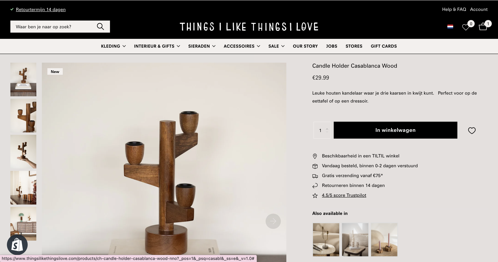

# Procesverslag
Markdown is een simpele manier om HTML te schrijven.  
Markdown cheat cheet: [Hulp bij het schrijven van Markdown](https://github.com/adam-p/markdown-here/wiki/Markdown-Cheatsheet).

Nb. De standaardstructuur en de spartaanse opmaak van de README.md zijn helemaal prima. Het gaat om de inhoud van je procesverslag. Besteedt de tijd voor pracht en praal aan je website.

Nb. Door *open* toe te voegen aan een *details* element kun je deze standaard open zetten. Fijn om dat steeds voor de relevante stuk(ken) te doen.

## Jij

  
uitwerken voor kick-off werkgroep

  ### Auteur:
  Aurelie van der Drift

  #### Je startniveau:
  Op het sleepliftje tussen de blauwe en rode piste.

  #### Je focus:
  responsive
 

## Je website

  
uitwerken voor kick-off werkgroep

  ### Je opdracht:
  www.thingsilikethingsilove.com

  #### Screenshot(s) van de eerste pagina (small screen): 
  hier de naam van de pagina  
  

  #### Screenshot(s) van de tweede pagina (small screen):
  hier de naam van de pagina  
  
 

## Toegankelijkheidstest 1/2 (week 1)

  
uitwerken na test in 2e werkgroep

  ### Bevindingen
  Lijst met je bevindingen die in de test naar voren kwamen:

  De website van Things I Like Things I Love scoort heel erg laag op de toegankelijkheidstest. Het is vrijwel onmogelijk om met een screenreader door de website heen te gaan. Er worden weinig tot geen alternatieve teksten toegevoegd aan afbeeldingen, opsommingen staan niet correct in UL en LI tags en H1,H2 etc. tags worden onjuist gebruikt. Wel krijg je een soort opties met druk ... voor navigatie maar dit werkt slecht.

  Al met al is er dus genoeg ruimte voor verbetering op het gebied van toegankelijkheid.

## Breakdownschets (week 1)

  
uitwerken na afloop 3e werkgroep

  ### de hele pagina: 
  

  ### dynamisch deel (bijv menu): 
  

  ### wellicht nog een dynamisch deel (bijv filter): 
  

## Voortgang 1 (week 2)

  
uitwerken voor 1e voortgang

  ### Stand van zaken
De HTML invoeren ging goed, hier heb ik weinig tot geen moeite mee. Ik moet voor sommige tags nog wel even opzoeken wat de beste optie is of welke ik nodig heb. CSS heb ik nog maar een klein beetje voor geschreven met echt de basis en dit ging me tot nu toe wel goed af.

  ### Agenda voor meeting
  samen met je groepje opstellen

  Ik heb voor de feedback sessie op dit moment nog geen vragen. Ik wil wel graag weten of de html die ik heb opgeschreven nu goed is.

  | student 1      | student 2          | student 3    | student 4        |
  | ---            | ---                | ---          | ---              |
  | dit bespreken  | en dit             | en ik dit    | en dan ik dat    |
  | en dat ook nog | dit als er tijd is | nog een punt | dit wil ik zeker |
  | ...            | ...                | ...          | ...              |

  ### Verslag van meeting
  hier na afloop snel de uitkomsten van de meeting vastleggen

  -  LANG-tags toevoegen voor als er Engelse tekst tussen Nederlandse tekst staat. 
  -  Uitleg gehad over wat een article is en wanneer je die gebruikt.

## Voortgang 2 (week 3)

  
uitwerken voor 2e voortgang

  ### Stand van zaken
  Wat goed ging was de algemene stijling in CSS. Wat minder goed ging was de header, maar daar ben ik natuurlijk al bij geholpen. Het eerste wat ik nu wil afmaken zijn de header en footer. Ik ga daarna verder met het afmaken van de Homepagina, ik verwacht met de homepagina (naast header en footer) niet al te veel struggles meer mee te hebben. ...

  ### Agenda voor meeting
  samen met je groepje opstellen

  | student 1      | student 2          | student 3    | student 4        |
  | ---            | ---                | ---          | ---              |
  | dit bespreken  | en dit             | en ik dit    | en dan ik dat    |
  | en dat ook nog | dit als er tijd is | nog een punt | dit wil ik zeker |
  | ... 
  
  Aurelie:
  aanroepen zonder classes en divs, ik heb een struggle op de homepagina hiermee.           | ...                | ...          | ...              |

  ### Verslag van meeting
  hier na afloop snel de uitkomsten van de meeting vastleggen

  - Ik ben geholpen met mijn struggle van de homepagina. Ik was de enige van mijn groepje die aanwezig was dus ik kon makkelijk al mijn vragen stellen. 

## Toegankelijkheidstest 2/2 (week 4)

  
uitwerken na test in 9e werkgroep

  ### Bevindingen
  Lijst met je bevindingen die in de test naar voren kwamen (geef ook aan wat er verbeterd is):

  Er zijn best wat dingen verbeterd. Zo kan je nu makkelijk door de homepagina links navigeren. De navigatie werkt nu ook goed. 

  Er waren ook een paar dingen die ik nog over het hoofd had gezien, die ga ik later nog even aanpassen. 

## Voortgang 3 (week 4)

  
uitwerken voor 3e voortgang

  ### Stand van zaken
  hier dit ging goed & dit was lastig (neem ook screenshots op van delen van je website en code)

  Het gaat me deze week wat minder goed af, ik vind het positioneren met grid best lastig en dat moet ik op deze pagina behoorlijk veel doen. Ik heb best veel hulp gevraagd en ook gehad maar ik blijf het lastig vinden. 

  ### Agenda voor meeting
  samen met je groepje opstellen

  | student 1      | student 2          | student 3    | student 4        |
  | ---            | ---                | ---          | ---              |
  | dit bespreken  | en dit             | en ik dit    | en dan ik dat    |
  | en dat ook nog | dit als er tijd is | nog een punt | dit wil ik zeker |
  | ...            | ...                | ...          | ...              |

Vragen over de Instagram feed en positioneren van de interieur slider. 

  ### Verslag van meeting
  hier na afloop snel de uitkomsten van de meeting vastleggen

  - punt 1
  - punt 2
  - nog een punt
  - ...

## Eindgesprek (week 5)

  
uitwerken voor eindgesprek

  ### Je uitkomst - karakteristiek screenshots:
  

  ### Dit ging goed/Heb ik geleerd: 
  Korte omschrijving met plaatjes

  

  ### Dit was lastig/Is niet gelukt:
  Korte omschrijving met plaatjes

  

## Bronnenlijst

  
continu bijhouden terwijl je werkt

  Nb. Wees specifiek ('css-tricks' als bron is bijv. niet specifiek genoeg). 
  Nb. ChatGpT en andere AI horen er ook bij.
  Nb. Vermeld de bronnen ook in je code.

  1. bron 1
  2. bron 2
  3. ...

